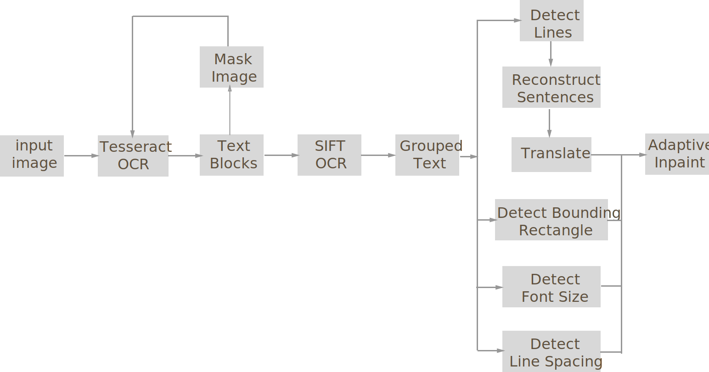
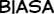
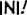
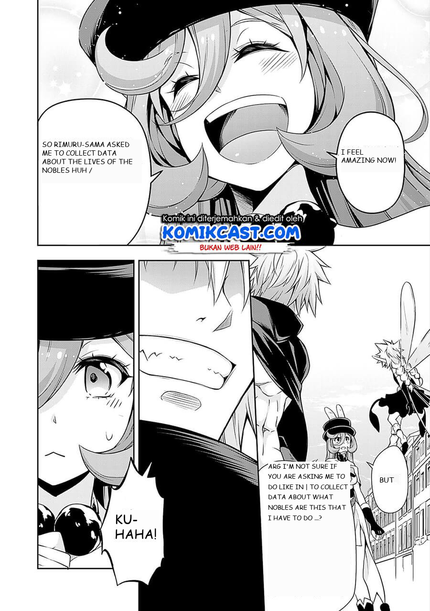
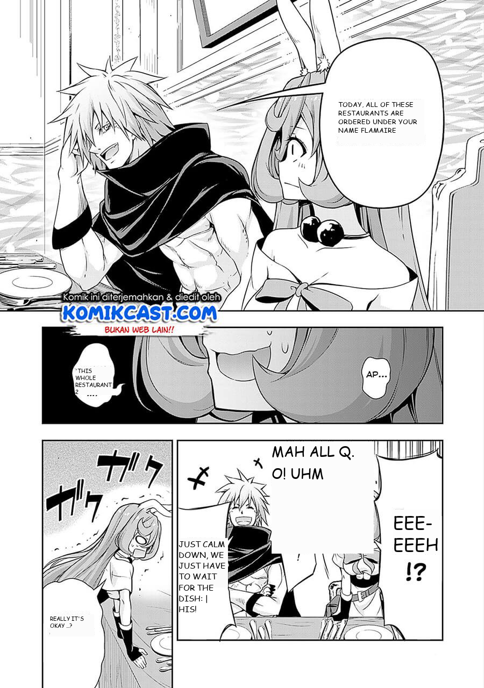

# Manga Text Detection, Extraction & Translation

### Contributors

Weiyao Tang, Zhaoran Ma, Jiachen Ren, Haoran Zhang, May Vy Le

### Abstract

[//]: # "abstract.md"
In recent years, more and more mangas are being made available online. With the increased availability comes the demand for the translation of mangas from one language to another to accommodate consumers from all over the world. Translation of manga can be a tedious work - aside from the expertise in the languages, there are many processes involved that can be automated. However, due to the scarcity of labelled data, few research has been done in the area. None produced an end-to-end translation system. Our proposed method, the **SIFT-OCR** manga translation system, is an end-to-end translation system that covers the entire pipeline with as little human intervention as possible. Based on Tesseract OCR, our system uses initial OCR results as ground truth SIFT vocabulary, then iteratively finds new, previously unidentified text in speech bubbles via SIFT matching and several other proprietary matching techniques. SIFT-OCR, the algorithm we designed for this purpose, outperforms the baseline (Google's Tesseract OCR) by a large margin. It extracts more text blocks from speech bubbles, has higher confidence in the recognized texts, and has less noise. This paper presents the details of the algorithm and qualitative performance comparison against the baseline.



### Introduction

[//]: # "introduction.md"
Manga, or comics, is a form of art that combines story telling and art. In recent years, this form of media has garnered attention
across language, culture and geological boundaries. This is largely due to an increasing number of mangas being made available online.
To meet the demand of the manga consumers all over the world, many translators are working hard to translate manga from their original
language (also called "RAW") into the language of their targeted audience. 
Our proposed system aims to automate the workflow of translating manga pages. However, before diving into the details of our method,
 it is necessary to first understand the structure of a manga page and the workflow of translators.

A typical manga page is broken down into several components - panels, speech bubbles, lines of text, and art.
To construct a manga page, several panels are laid out in the page, each containing a piece of art. 
Panels are not necessarily rectangular, and does not necessarily have boundaries - it is a very flexible form of layout.
Then, speech bubbles are overlaid on top of the panels (or some times clipped by the panels), each of which containing
lines of text detailing the story.

As for the workflow of a translator, it includes locating speech bubbles, manually transcribing text from the source language,
then translating the text from source language to target language (which requires expertise in both), then finally, formatting
the translated text so it can fit back into the original speech bubble.

Unsurprisingly, many of the steps above are tedious and can be automated using modern deep learning approaches. However,
despite the fact that manga is full of interesting information that is suitable for supervised ML tasks such as object recognition,
image segmentation, machine translation, etc., there is a lack of
dataset and ground truth labelling for supervised machine learning tasks. This is due to copyright protection and many other
caveats that come with intellectual property. As a result, most of the research done in this area either use self-collected datasets that
are undisclosed or the [eDBtheque](http://ebdtheque.univ-lr.fr) dataset, a dataset of 100 pages with pixel-level ground truth labelling for panels.
The results from these researches that employ custom designed deep neural nets either focus on specific tasks such as speech bubble localization
of mangas in a specific language and genre ([Deep CNN-based Speech Balloon Detection and Segmentation for Comic Books](https://arxiv.org/pdf/1902.08137.pdf)), or text bounding box extraction for mangas in a specific language ([Japanese OCR](https://github.com/phamdinhthang/japanese_OCR)).
The point is, none of these produce an end-to-end system with high level of performance.

Our approach introduces several innovations in designing an end-to-end pipeline for automated manga translation. In tackling this
challenging problem, we combined traditional machine learning and computer vision algorithms with deep learning methods to achieve
results far better than the baseline approach. Specifically, we come up with the **SIFT guided OCR** algorithm to extract text from
manga speech bubbles. We show that our algorithm performs far better than the baseline in the industry with qualitative results.

### Approach

[//]: # "approach.md"
#### Dependencies

**pytesseract**

Our system builds on top of existing state-of-the-art OCR technology, [Google's Tesseract OCR](https://github.com/tesseract-ocr/tesseract).
Tesseract OCR, currently maintained by google, has a long and robust history and is indisputably the go-to
open source OCR engine. Tesseract OCR is capable of recognizing many different languages, but it is designed to recognize
text in a structured document (think of a scanned novel, paper rendered with latex, etc.), not for recognizing text in an
image that consists mostly of art. However, as we have tested, it is indeed capable of extracting some texts along with their
bounding box from a manga page, which is enough for our purpose. Note that Tesseract has a python API wrapper in the form of a package,
[pytesseract](https://pypi.org/project/pytesseract/). The API is very basic as it only invokes the commandline API of Tesseract,
which is installed separately, and returns a CSV of extracted texts and their respective bounding boxes. To adapt it for our project,
we made a higher level API wrapper for `pytesseract`, which can be found [here](https://github.com/JiachenRen/cs4476-cv-project/blob/master/src/ocr/TextBlockInfo.py).

**opencv-python**

We use existing functions of [opencv-python](https://pypi.org/project/opencv-python/) for the following tasks:
- Preprocess input image by applying threshold and de-noise
- `SIFT` related functionalities for extracting features from recognized text blocks
- Flood fill of speech bubbles using SIFT key points cluster centers as seeding coordinates
- Morphing (dilation and erosion) of speech bubble binary mask to erase text contours

**sklearn**

We use several clustering algorithms from [sklearn](https://scikit-learn.org/stable/) including [mean-shift](https://scikit-learn.org/stable/modules/generated/sklearn.cluster.MeanShift.html) and [kmeans](https://scikit-learn.org/stable/modules/generated/sklearn.cluster.KMeans.html) in several places. We will explain the usage in detail in the [SIFT-OCR Algorithm](#sift-ocr-algorithm) section.

#### SIFT-OCR Algorithm

As previously mentioned in the [Dependencies](#dependencies) section, Tesseract performs well on structured documents, not on mangas (we will demonstrate this as baseline results in the Experiments & Results section). To adapt Tesseract OCR so it can perform well on manga pages, we designed the SIFT-OCR algorithm. If you wish to look at the python source code, you can find it [here](https://github.com/JiachenRen/cs4476-cv-project/blob/master/src/ocr/sift_ocr.py) - we believe that our code is extremely well documented, so it is strongly encouraged to read it. Here are the details of this algorithm, broken down into steps:

1. Use Tesseract OCR on the input image to extract initial text bounding boxes. At this point, each bounding box contains a line of text/characters.
2. Run Iterative OCR until no more text can be extracted (See [iterative_ocr.py](https://github.com/JiachenRen/cs4476-cv-project/blob/master/src/ocr/iterative_ocr.py)).
3. Learn SIFT descriptors from extracted bounding boxes to build the vocabulary. Essentially, we are learning language and font dependent characteristics of the text.
4. Extract SIFT descriptors from the input image.
5. Find good matches between vocabulary descriptors (descriptors extracted from lines of text) and input image descriptors - these are likely places where Tesseract OCR failed to recognize text.
6. Use MeanShift clustering on keypoint coordinates of matched descriptors to hypothesize speech bubble centers, apply thresholding on number of instances in each center to throw away some "bad" centers.
7. Extract pixels from arbitrarily sized rectangles centered at each cluster center from step 6, then use KMeans clustering on the pixels to find the dominant color - this is the background color of the speech bubble.
8. Flood fill speech bubbles. The cluster centers from step 6 are used as seeding coordinate, and the background color from step 7 is used as seeding color for each speech bubble respectively.
9. At this point, we have obtained binary masks shaped like speech bubbles. However, since flood fill is applied using the background color as seeding color, the texts in the bubble are not part of the mask. To morph the mask to consume the texts within, apply dilation and erosion filters using opencv.
10. Use the bubble as a binary mask to mask irrelevant parts of input image.
11. Run boundary detection on speech bubble masks, then calculate their bounding box using the detected boundary  (again, using opencv).
12. For each of the detected binary speech bubble mask and their bounding box, first apply the binary mask so only the text within the speech bubble remains, then crop the image using the bounding box so the text becomes centered.
13. Run Tesseract OCR again on each of the cropped, text-only images to detect and group found text blocks. The output of SIFT-OCR is a dictionary of `[GroupIndex: List[TextBlockInfo]]` that groups detected text blocks by the index of speech bubbles that the text belongs to.

The algorithm is based on the following assumptions:

1. Most speech bubbles have a closed, solid boundary (otherwise flood fill won't work). Although during experimentation, we found that the algorithm still achieves respectable results for non-closed-boundary speech bubbles.
2. Speech bubbles have mostly uniform background color (which is true). This is also a prerequisite for flood fill.
3. Tesseract OCR can extract some initial text bounding boxes (otherwise we can't build SIFT vocabulary)

Intuitively, since we know that SIFT is good at finding places that are similar to the vocabulary (in our case texts), SIFT-OCR
combines the advantages of SIFT and Tesseract OCR. Essentially, we first use Tesseract OCR to establish some ground truth of what text should
look like in this particular manga page. Then, using SIFT, we find all places where text might be in the page (what Tesseract OCR is not made to do).
Then, using this info, we can "de-noise" the input and guide Tesseract to work on speech bubbles only. Since text in speech bubbles appear as structured documents,
Tesseract achieves far better results than the baseline.

#### Translation & In-painting

To reconstruct sentences from each group of text blocks, first a `MeanShift` clustering with window size of `5` is done on the y coordinates of the corresponding bounding boxes to detect lines, then the text blocks are sorted first by their y coordinate (rounded to the nearest cluster center) and then by their x coordinate. 

Next, we use Google Translate to translate the obtained sentences in the source language. There's not much to talk about here except that we combine everything extracted from a manga page into a single document and use that as the query to the Google Translate API, which minimizes asynchronous network operations. For our implementation (ported from dart language), refer to [google_translate.py](https://github.com/JiachenRen/cs4476-cv-project/blob/master/src/translation/google_translate.py) and [google_token_generator.py](https://github.com/JiachenRen/cs4476-cv-project/blob/master/src/translation/google_token_generator.py).

Finally, for each grouped text blocks, we calculate various parameters related to painting the translated text back onto the original image. These parameters include font size, line spacing, color, and warp-around parameters. Drawing text over image is done using `PIL` package. For more details, refer to [inpainting.py](https://github.com/JiachenRen/cs4476-cv-project/blob/master/src/inpainting.py). Detailed documentations are provided there.

In the next section, we will present qualitative results from each stage of our proposed pipeline and compare final results with baseline results.

### Experiments and Results

[//]: # "experiments_and_results.md"
#### Data

Initially, we have planned to use a database with ground truth labelling to train a deep learning model to detect speech bubbles and structured text. However, the acquisition of the only known dataset for such a task, **eDBtheque**, requires prior authorization by the researchers at France. Due to this, there was a delay in getting the database - by that time we've already developed a non-deep-learning, traditional CV and ML oriented pipeline to accomplish our objective. We do, however, plan to use the database for the final
stage of our project if time permits.

In order to run experiments, test hypothesis, and assess how well our algorithm performs compared to the baseline, we have collected our own dataset. Our dataset consists of two random chapters of two mangas crawled from the indonesian manga website, [sektekomik.com](https://sektekomik.com). Here are some random pages from our dataset:

<table>
	<tr>
		<td>
			
		</td>
		<td>
			
		</td>
		<td>
			
		</td>
	</tr>
</table>
Our dataset contains manga pages with romantized Indonesian text. All the experimental results below are obtained from these pages. However, do note that our system is scalable to other languages - Tesseract is multilingual and SIFT learns from Tesseract results. 


#### SIFT-OCR Pipeline

In this section, we will show results obtained from each stage of our pipeline.


##### Input pages

<table>
	<tr>
		<th>Slime page 4 (S4)</th>
		<th>Slime page 5 (S5)</th>
	</tr>
	<tr>
		<td>
			
		</td>
		<td>
			
		</td>
	</tr>
</table>


##### Initial Tesseract text block extraction (step 1)

Some "good" text blocks from S4

<table>
  <tr>
    <td>
      
  		
			
			
			
      
      
      
      
      
  	</td>
  </tr>
	<tr>
    <td>
      
			
			
			
      
      
			
			
			
  	</td>
  </tr>
	<tr>
    <td>
      
			
			
			
      
      
			
			
			
  	</td>
  </tr>
</table>
Not all text blocks actually contains texts, here are all bad text blocks from S4

<table>
  <tr>
    <td>
      
			
			
			
			
  	</td>
  </tr>
</table>


##### Learned SIFT descriptor keypoints from text blocks (step 3)

Here are some keypoint descriptors learned from the text blocks that serve as vocabulary (visualized using open cv). Results are quite similar so we are only showing the descriptors for S4.

<table>
  <tr>
    <td>
      
      
      
      
      
      
      
      
      
    </td>
  </tr>
</table>


##### Find good SIFT matches in input image and cluster using MeanShift (steps 4, 5, 6)

Red rectangles are sift mathces while green rectangles are match cluster centers. Grey rectangles are match centers discarded after thresholding on matched instances in each center.

<table>
	<tr>
		<th>S4 matches</th>
		<th>S5 matches</th>
	</tr>
	<tr>
		<td>
			
		</td>
		<td>
			
		</td>
	</tr>
</table>


##### Extracted speech bubble masks (steps 7, 8, 9)

Speech bubble masks extracted from S4

<table>
    <tr>
        <th>Good</th>
    </tr>
    <tr>
        <td>
            
        </td>
        <td>
            
        </td>
        <td>
            
        </td>
        <td>
            
        </td>
        <td>
            
        </td>
    </tr>
    <tr>
        <th>Bad</th>
    </tr>
	<tr>
		<td>
			
		</td>
        <td>
			
		</td>
        <td>
			
		</td>
	</tr>
</table>

Speech bubble masks extracted from S5

<table>
    <tr>
        <th>Good</th>
    </tr>
	<tr>
		<td>
			
		</td>
        <td>
			
		</td>
        <td>
			
		</td>
    </tr>
</table>


##### Mask, crop, then detect text in speech bubbles (steps 10, 11, 12)

Results from S4

<table>
  <tr>
    <td>
      
    </td>
    <td>
      
    </td>
    <td>
      
    </td>
    <td>
      
    </td>
    <td>
      
    </td>
  </tr>
</table>

Results from S5

<table>
  <tr>
    <td>
      
      
      
    </td>
  </tr>
</table>


##### Final Results 

Final results compared with baseline. Baseline is the text blocks detected by directly running Tesseract OCR on the input image.

S4 side by side comparison with baseline

<table>
  <tr>
    <th>Baseline (Tesseract Only)</th>
    <th>SIFT-OCR (Ours)</th>
  </tr>
  <tr>
    <td>
    	
	</td>
	<td>
    	
	</td>
  </tr>
</table>


S5 side by side comparison with baseline

<table>
  <tr>
    <th>Baseline (Tesseract Only)</th>
    <th>SIFT-OCR (Ours)</th>
  </tr>
	<tr>
    <td>
    	
	</td>
	<td>
        
	</td>
  </tr>
</table>


#### Parameters

SIFT-OCR algorithm has many tunable parameters, they are explained in the documentation below

```python
def sift_ocr(image: Image.Image, parser: TextBlockInfoParser, sift_ocr_path='../gen/sift_ocr', morph_rect_size=40,
             mean_shift_bandwidth=80, min_cluster_label_count=2, sift_match_threshold=0.7,
             flood_mask_size=50, flood_tolerance=(5, 5, 5)) -> Dict[int, List[TextBlockInfo]]:
    """
    :param image: input image
    :param parser: text block info parser to use
    :param min_cluster_label_count: min number of points labelled for a cluster to keep it
    :param sift_match_threshold: threshold to keep sift matches, between 0-1, (smaller value = stricter match)
    :param flood_mask_size: size of the mask to use at cluster centers to facilitate flooding
    :param morph_rect_size: size of the structuring element used to fill characters in text balloons
    :param flood_tolerance: max allowed flood error in (R, G, B) when flooding speech bubbles
    :param sift_ocr_path: path to store sift_ocr intermediaries
    :param mean_shift_bandwidth: bandwidth for mean shift clustering of matched keypoints from input image
    :return: a dictionary with keys to denote group number, and values are extracted text blocks in the group
             dict[0] contains all blocks detected by iterative OCR
    """
```

The full definition of the function can be found [here](https://github.com/JiachenRen/cs4476-cv-project/blob/master/src/ocr/sift_ocr.py).

The parameters used to generate the results above are listed below (the same for both page 4 and 5):

```yaml
Parser:
  - max_block_height: 50
  - min_confidence: 0
  - validation_regex: [a-zA-Z\?\.\,0-9\)\(]+

Sift OCR:
  - morph_rect_size: 40
  - mean_shift_bandwidth: 80
  - min_cluster_label_count: 1
  - sift_match_threshold: 0.7
  - flood_mask_size: 50
  - flood_tolerance: (5, 5, 5)
```

During experimentation, we found that the above parameters work really well for most cases.

#### Qualitative Results

[//]: # "qualitative_results.md"
[//]: # "
Show several visual examples of inputs/outputs of your system (success cases and failures) that help us better understand your approach.
"
Previously, to better demonstrate how our algorithm works, we deliberately chose shorter manga pages. Our algorithm, however,
very easily scales to longer pages, achieving equal performance. More qualitative results can be found below

- [Demon King Page 2](src/final/images/ocr_results/demon_king_page_2/README.md)
- [Demon King Page 3](src/final/images/ocr_results/demon_king_page_3/README.md)
- [Slime Page 4](src/final/images/ocr_results/slime_page_4/README.md) (Old)
- [Slime Page 5](src/final/images/ocr_results/slime_page_5/README.md) (Old)
- [Slime Page 8](src/final/images/ocr_results/demon_king_page_2/README.md)

#### Pipeline Results

The images below are obtained by running the input image through our pipeline in an end-to-end manner. Left is the original image while right is the original image with translated text painted in with stylistic consistency in mind (stylistic consistency is ensured by our algorithm, as it discovers optimum painting parameters using various aspects of the data extracted from previous steps).

| Original      | Translated |
| ------------- | ---------- |
|  |             |

| Original      | Translated |
| ------------- | ---------- |
|  |             |

| Original      | Translated |
| ------------- | ---------- |
|  |             |

Notice that our algorithm detects font size, line spacing, and bounding box from text blocks and uses this information to adaptively paint new text over the original image. Of course, the algorithm is still prone to error - while the first two examples demonstrates stellar performance, the third example shows a miscalculation of bounding rect due to noises in text blocks (in the lower left panel), resulting in malformatted text. 

Note that we also wrote a simple algorithm to detect foreground and background color automatically from the original image. These colors are used to ensure stylistic consistency. 


### Conclusion

[//]: # "conclusion.md"
Manga is a hobby that many people around the world indulged in to relax, like watching a movie or reading a book. One major problem with the increased availability of online manga is that if a person does not understand the original language that the manga was first written in, it may take awhile for translators to interpret the language to English. This motivated us to design a system - called the SIFT-OCR manga translation system - that solves this problem using programming instead of relying on manga translators. So far, we have demonstrated the outstanding performance of SIFT-OCR compared to the baseline method in the task of extracting text from manga speech bubbles. This is the most difficult hurdle to get over in our pipeline. It required huge amount of innovation and effort from our team. That said, the algorithm is not without its defects - it has many tunable parameters, the effects of some are not fully understood. No matter how well an automated system performs, mistakes are inevitable - to make our system production ready, we'll also need to add UI for humans to optionally step in at every stage of the pipeline. 

In addition to detecting and grouping word-level text blocks, which was completed earlier, we were able to complete everything described in our original proposal and produced a working end-to-end pipelined system. The pipeline can now reconstruct original sentences back by analyzing the bounding rectangles of the text blocks, use google translate to translate from source language to target language, and finally, upon analyzing text bounding boxes for line spacing, font-size, background color, foreground color, and other related attributes, repaint the translated text over the original manga page in a stylistically consistent manner. 


### References

[//]: # "references.md"
Dubray, D., & Laubrock, J. (2019). Deep CNN-based Speech Balloon Detection and Segmentation for Comic Books. [https://arxiv.org/pdf/1902.08137.pdf](https://arxiv.org/pdf/1902.08137.pdf)

Gu’erin, Cl’ement, Rigaud, Mercier, Antoine, Ammar-Boudjelal, Farid, Bertet, Karell, Bouju, & Alain. (2013). eBDtheque: a representative database of comics. 1145–1149. eDBtheque. [http://ebdtheque.univ-lr.fr]()

Lee, M. (n.d.). pytesseract: Python-tesseract is a python wrapper for Google’s Tesseract-OCR. PyPI. [https://pypi.org/project/pytesseract/](https://pypi.org/project/pytesseract/)

opencv-python. (2019, November 21). PyPI. https://pypi.org/project/opencv-python/

scikit-learn: machine learning in Python — scikit-learn 0.20.3 documentation. (2019). Scikit-Learn.Org. [https://scikit-learn.org/stable/](https://pypi.org/project/pytesseract/)

tesseract-ocr. (2019, October 20). tesseract-ocr/tesseract. GitHub; Google. [https://github.com/tesseract-ocr/tesseract](https://github.com/tesseract-ocr/tesseract)

Thang, P. D. (2020, August 25). phamdinhthang/japanese_OCR. GitHub. [https://github.com/phamdinhthang/japanese_OCR](https://github.com/phamdinhthang/japanese_OCR)


