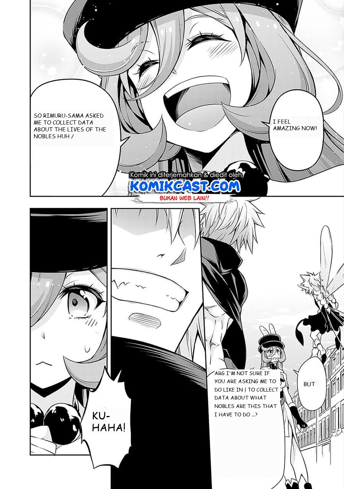
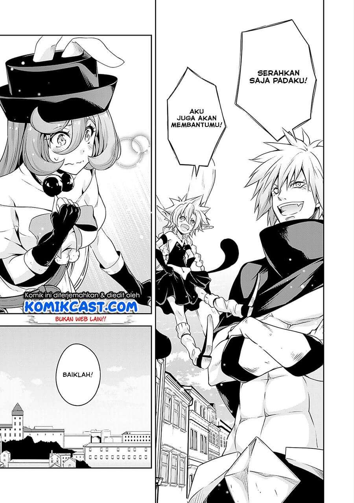
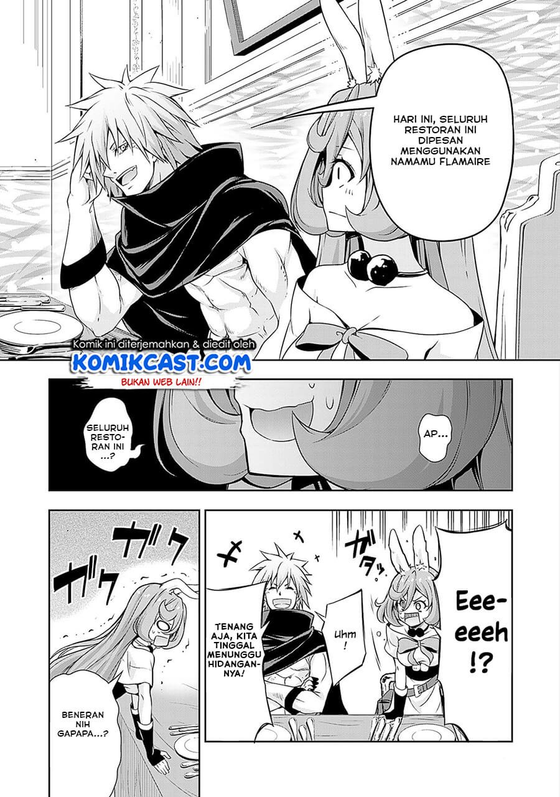
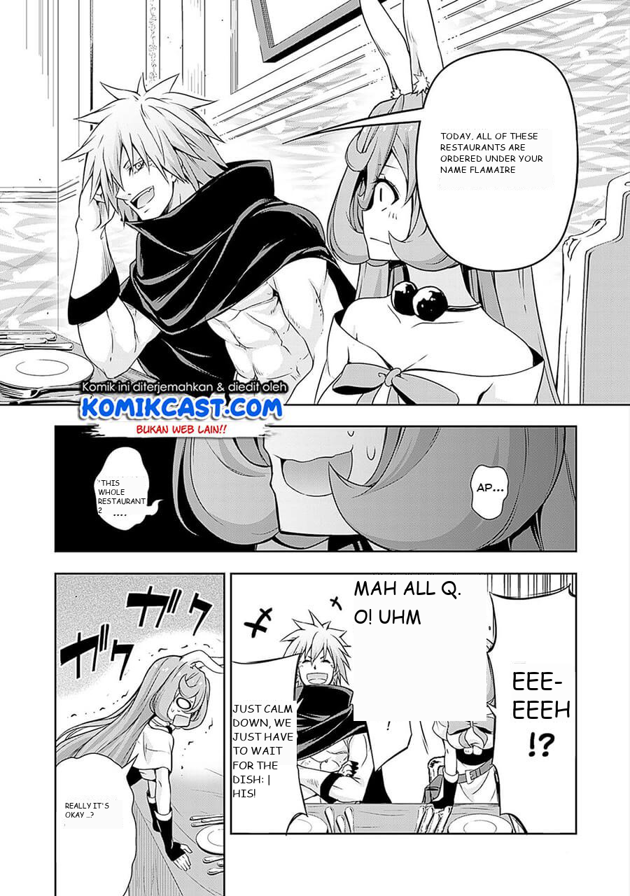

[//]: # "
Show several visual examples of inputs/outputs of your system (success cases and failures) that help us better understand your approach.
"
Previously, to better demonstrate how our algorithm works, we deliberately chose shorter manga pages. Our algorithm, however,
very easily scales to longer pages, achieving equal performance. More qualitative results can be found below

- [Demon King Page 2](../images/ocr_results/demon_king_page_2/README.md)
- [Demon King Page 3](../images/ocr_results/demon_king_page_3/README.md)
- [Slime Page 4](../images/ocr_results/slime_page_4/README.md) (Old)
- [Slime Page 5](../images/ocr_results/slime_page_5/README.md) (Old)
- [Slime Page 8](../images/ocr_results/demon_king_page_2/README.md)

##### Pipeline Results

| Original      | Translated |
| ------------- | ---------- |
|  |             |

| Original      | Translated |
| ------------- | ---------- |
|  |             |

| Original      | Translated |
| ------------- | ---------- |
|  |             |

Our results are shown as above. Notice that our algorithm detects font size, line spacing, and bounding box from text blocks and uses this information to adaptively paint new text over the original image. Of course, the algorithm is still prone to error - while the first two examples demonstrates stellar performance, the third example shows a miscalculation of bounding rect due to noises in text blocks (in the lower left panel), resulting in malformatted text. 

Note that we also wrote a simple algorithm to detect foreground and background color automatically from the original image. These colors are used for the mask used to cover original  later to ensure stylistic consistency. 