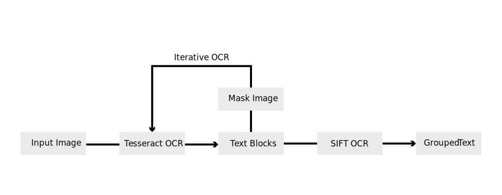

In recent years, more and more mangas are being made available online. With the increased availability comes the demand for the translation of mangas from one language to another to accommodate consumers from all over the world. Translation of manga can be a tedious work - aside from the expertise in the languages, there are many processes involved that can be automated. However, due to the scarcity of labelled data, few research has been done in the area. None produced an end-to-end translation system. Our proposed method, the **SIFT-OCR** manga translation system, is an end-to-end translation system that covers the entire pipeline with as little human intervention as possible. Based on Tesseract OCR, our system uses initial OCR results as ground truth SIFT vocabulary, then iteratively finds new, previously unidentified text in speech bubbles via SIFT matching and several other proprietary matching techniques. SIFT-OCR, the algorithm we designed for this purpose, outperforms the baseline (Google's Tesseract OCR) by a large margin. It extracts more text blocks from speech bubbles, has higher confidence in the recognized texts, and has less noise. This paper presents the details of the algorithm and qualitative performance comparison against the baseline.

