# Manga Text Detection, Extraction & Translation

### Contributors

Weiyao Tang, Zhaoran Ma, Jiachen Ren, Haoran Zhang, May Vy Le

### Abstract

[//]: # "abstract.md"
[//]: # "
One or two sentences on the motivation behind the problem you are solving. 
One or two sentences describing the approach you took. 
One or two sentences on the main result you obtained.
Teaser figure that conveys the main idea behind the project or the main application being addressed.
"

### Introduction

[//]: # "introduction.md"
[//]: # "
Motivation behind the problem you are solving, 
what applications it has, 
any brief background on the particular domain you are working in (if not regular RBG photographs), etc. 
If you are using a new way to solve an existing problem, 
briefly mention and describe the existing approaches and tell us how your approach is new.
"
Manga, or comics, is a form of art that combines story telling and art. In recent years, this form of media has garnered attention
across language, culture and geological boundaries. This is largely due to an increasing number of mangas being made available online.
To meet the demand of the manga consumers all over the world, many translators are working hard to translate manga from their original
language (also called "RAW") into the language of their targeted audience. 
Our proposed system aims to automate the workflow of translating manga pages. However, before diving into the details of our method,
 it is necessary to first understand the structure of a manga page and the workflow of translators.

A typical manga page is broken down into several components - panels, speech bubbles, lines of text, and art.
To construct a manga page, several panels are laid out in the page, each containing a piece of art. 
Panels are not necessarily rectangular, and does not necessarily have boundaries - it is a very flexible form of layout.
Then, speech bubbles are overlaid on top of the panels (or some times clipped by the panels), each of which containing
lines of text detailing the story.

As for the workflow of a translator, it includes locating speech bubbles, manually transcribing text from the source language,
then translating the text from source language to target language (which requires expertise in both), then finally, formatting
the translated text so it can fit back into the original speech bubble.

Unsurprisingly, many of the steps above are tedious and can be automated using modern deep learning approaches. However,
despite the fact that manga is full of interesting information that is suitable for supervised ML tasks such as object recognition,
image segmentation, machine translation, etc., there is a lack of
dataset and ground truth labelling for supervised machine learning tasks. This is due to copyright protection and many other
caveats that come with intellectual property. As a result, most of the research done in this area either use self-collected datasets that
are undisclosed or the [eDBtheque](http://ebdtheque.univ-lr.fr) dataset, a dataset of 100 pages with pixel-level ground truth labelling for panels.
The results from these researches that employ custom designed deep neural nets either focus on specific tasks such as speech bubble localization
of mangas in a specific language and genre (**Todo: references here**), or text bounding box extraction for mangas in a specific language (**Todo: references here**).
The point is, none of these produce an end-to-end system with high level of performance.

Our approach introduces several innovations in designing an end-to-end pipeline for automated manga translation. In tackling this
challenging problem, we combined traditional machine learning and computer vision algorithms with deep learning methods to achieve
results far better than the baseline approach. Specifically, we come up with the **SIFT guided OCR** algorithm to extract text from
manga speech bubbles. We show that our algorithm performs far better than the baseline in the industry with qualitative results.

**Todo: Teaser Figure**

### Approach

[//]: # "approach.md"
[//]: # "
Describe very clearly and systematically your approach to solve the problem. 
Tell us exactly what existing implementations you used to build your system. 
Tell us what obstacles you faced and how you addressed them. 
Justify any design choices or judgment calls you made in your approach.
"

#### Dependencies

**pytesseract**

Our system builds on top of existing state-of-the-art OCR technology, [Google's Tesseract OCR](https://github.com/tesseract-ocr/tesseract).
Tesseract OCR, currently maintained by google, has a long and robust history and is indisputably the go-to
open source OCR engine. Tesseract OCR is capable of recognizing many different languages, but it is designed to recognize
text in a structured document (think of a scanned novel, paper rendered with latex, etc.), not for recognizing text in an
image that consists mostly of art. However, as we have tested, it is indeed capable of extracting some texts along with their
bounding box from a manga page, which is enough for our purpose. Note that Tesseract has a python API wrapper in the form of a package,
[pytesseract](https://pypi.org/project/pytesseract/). The API is very basic as it only invokes the commandline API of Tesseract,
which is installed separately, and returns a CSV of extracted texts and their respective bounding boxes. To adapt it for our project,
we made a higher level API wrapper for `pytesseract`, which can be found [here](https://github.com/JiachenRen/cs4476-cv-project/blob/master/src/ocr/TextBlockInfo.py).

**opencv-python**

We use existing functions of [opencv-python](https://pypi.org/project/opencv-python/) for the following tasks:
- Preprocess input image by applying threshold and de-noise
- `SIFT` related functionalities for extracting features from recognized text blocks
- Flood fill of speech bubbles using SIFT key points cluster centers as seeding coordinates
- Morphing (dilation and erosion) of speech bubble binary mask to erase text contours

**sklearn**

We use several clustering algorithms from [sklearn](https://scikit-learn.org/stable/) including [mean-shift](https://scikit-learn.org/stable/modules/generated/sklearn.cluster.MeanShift.html) and [kmeans](https://scikit-learn.org/stable/modules/generated/sklearn.cluster.KMeans.html) in several places. We will explain the usage in detail in the [SIFT-OCR Algorithm](#sift-ocr-algorithm) section.

#### SIFT-OCR Algorithm

As previously mentioned in the [Dependencies](#dependencies) section, Tesseract performs well on structured documents, not on mangas (we will demonstrate this as baseline results in the Experiments & Results section). To adapt Tesseract OCR so it can perform well on manga pages, we designed the SIFT-OCR algorithm. If you wish to look at the python source code, you can find it [here](https://github.com/JiachenRen/cs4476-cv-project/blob/master/src/ocr/sift_ocr.py) - we believe that our code is extremely well documented, so it is strongly encouraged to read it. Here are the details of this algorithm, broken down into steps:

1. Use Tesseract OCR on the input image to extract initial text bounding boxes. At this point, each bounding box contains a line of text/characters.
2. Run Iterative OCR until no more text can be extracted (See [iterative_ocr.py](https://github.com/JiachenRen/cs4476-cv-project/blob/master/src/ocr/iterative_ocr.py)).
3. Learn SIFT descriptors from extracted bounding boxes to build the vocabulary. Essentially, we are learning language and font dependent characteristics of the text.
4. Extract SIFT descriptors from the input image.
5. Find good matches between vocabulary descriptors (descriptors extracted from lines of text) and input image descriptors - these are likely places where Tesseract OCR failed to recognize text.
6. Use MeanShift clustering on keypoint coordinates of matched descriptors to hypothesize speech bubble centers, apply thresholding on number of instances in each center to throw away some "bad" centers.
7. Extract pixels from arbitrarily sized rectangles centered at each cluster center from step 6, then use KMeans clustering on the pixels to find the dominant color - this is the background color of the speech bubble.
8. Flood fill speech bubbles. The cluster centers from step 6 are used as seeding coordinate, and the background color from step 7 is used as seeding color for each speech bubble respectively.
9. At this point, we have obtained binary masks shaped like speech bubbles. However, since flood fill is applied using the background color as seeding color, the texts in the bubble are not part of the mask. To morph the mask to consume the texts within, apply dilation and erosion filters using opencv.
10. Use the bubble as a binary mask to mask irrelevant parts of input image.
11. Run boundary detection on speech bubble masks, then calculate their bounding box using the detected boundary  (again, using opencv).
12. For each of the detected binary speech bubble mask and their bounding box, first apply the binary mask so only the text within the speech bubble remains, then crop the image using the bounding box so the text becomes centered.
13. Run Tesseract OCR again on each of the cropped, text-only images to detect and group found text blocks. The output of SIFT-OCR is a dictionary of `[GroupIndex: List[TextBlockInfo]]` that groups detected text blocks by the index of speech bubbles that the text belongs to.

The algorithm is based on the following assumptions:

1. Most speech bubbles have a closed, solid boundary (otherwise flood fill won't work). Although during experimentation, we found that the algorithm still achieves respectable results for non-closed-boundary speech bubbles.
2. Speech bubbles have mostly uniform background color (which is true). This is also a prerequisite for flood fill.
3. Tesseract OCR can extract some initial text bounding boxes (otherwise we can't build SIFT vocabulary)

Intuitively, since we know that SIFT is good at finding places that are similar to the vocabulary (in our case texts), SIFT-OCR
combines the advantages of SIFT and Tesseract OCR. Essentially, we first use Tesseract OCR to establish some ground truth of what text should
look like in this particular manga page. Then, using SIFT, we find all places where text might be in the page (what Tesseract OCR is not made to do).
Then, using this info, we can "de-noise" the input and guide Tesseract to work on speech bubbles only. Since text in speech bubbles appear as structured documents,
Tesseract achieves far better results than the baseline. In the next section, we will present qualitative results from each stage of our proposed pipeline and compare
final results with baseline results.

### Experiments and Results

[//]: # "experiments_and_results.md"
[//]: # "
 Provide details about the experimental set up (number of images/videos, number of datasets you experimented with, train/test split if you used machine learning algorithms, etc.). 
 Describe the evaluation metrics you used to evaluate how well your approach is working. 
 Include clear figures and tables, as well as illustrative qualitative examples if appropriate. 
 Be sure to include obvious baselines to see if your approach is doing better than a naive approach (e.g. for classification accuracy, how well would a classifier do that made random decisions?). 
 Also discuss any parameters of your algorithms, and tell us how you set the values of those parameters. 
 You can also show us how the performance varies as you change those parameter values. 
 Be sure to discuss any trends you see in your results, and explain why these trends make sense. 
 Are the results as expected? Why?
"

#### Data

Initially, we have planned to use a database with ground truth labelling to train a deep learning model to detect speech bubbles and structured text. However, the acquisition of the only known dataset for such a task, **eDBtheque**, requires prior authorization by the researchers at France. Due to this, there was a delay in getting the database - by that time we've already developed a non-deep-learning, traditional CV and ML oriented pipeline to accomplish our objective. We do, however, plan to use the database for the final
stage of our project if time permits.

In order to run experiments, test hypothesis, and assess how well our algorithm performs compared to the baseline, we have collected our own dataset. Our dataset consists of two random chapters of two mangas crawled from the indonesian manga website, [sektekomik.com](https://sektekomik.com). Here are some random pages from our dataset:

<table>
	<tr>
		<td>
			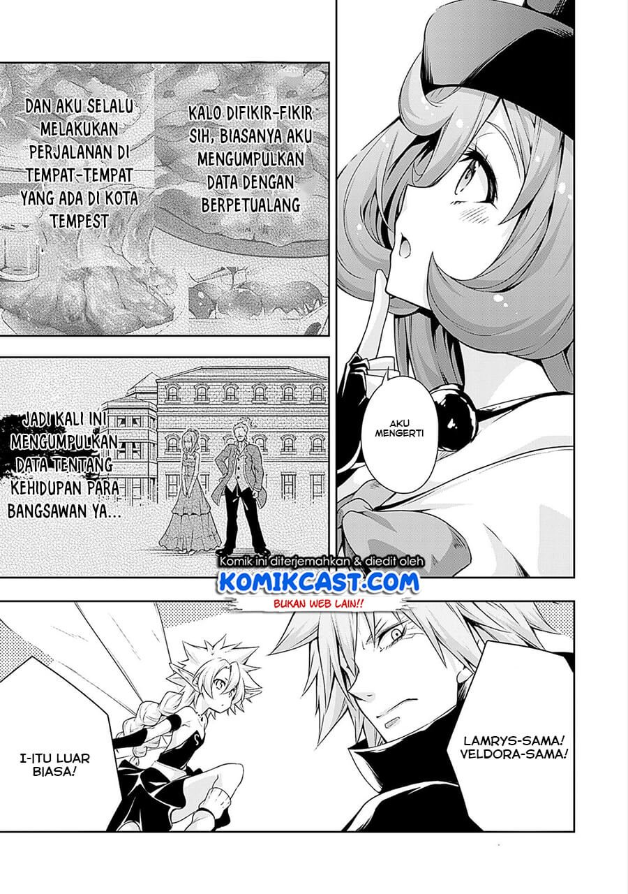</img>
		</td>
		<td>
			</img>
		</td>
		<td>
			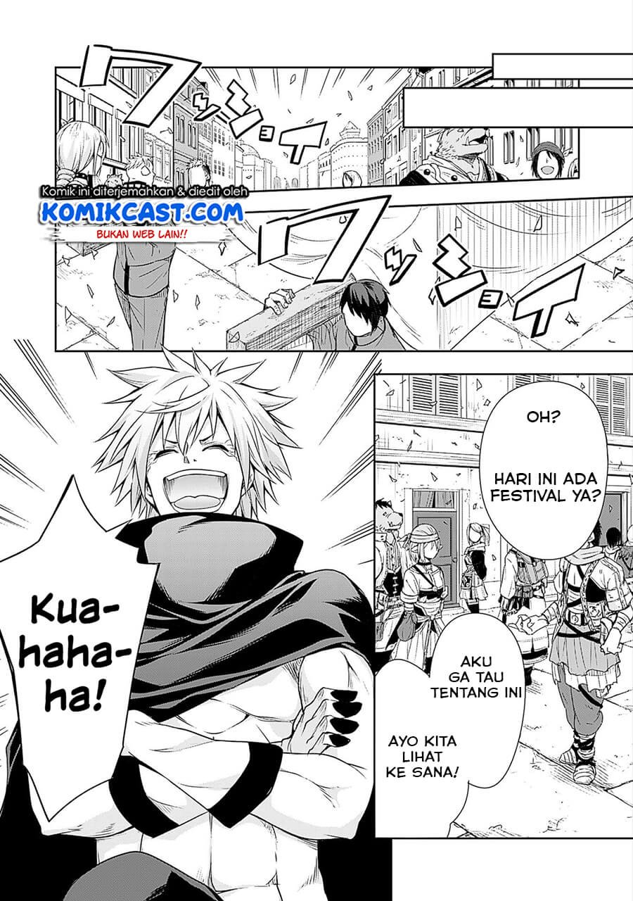</img>
		</td>
	</tr>
</table>
Our dataset contains manga pages with romantized Indonesian text. All the experimental results below are obtained from these pages. However, do note that our system is scalable to other languages - Tesseract is multilingual and SIFT learns from Tesseract results. 

#### SIFT-OCR Pipeline

In this section, we will show results obtained from each stage of our pipeline.

##### Input pages

<table>
	<tr>
		<th>Slime page 4</th>
		<th>Slime page 5</th>
	</tr>
	<tr>
		<td>
			</img>
		</td>
		<td>
			</img>
		</td>
	</tr>
</table>

##### Initial Tesseract text block extraction (step 1)

Some "good" text blocks from page 4 of slime:

<table>
  <tr>
    <td>
      </img>
  		</img>
			</img>
			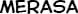</img>
			</img>
      </img>
      </img>
      </img>
      </img>
      </img>
  	</td>
  </tr>
	<tr>
    <td>
      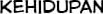</img>
			</img>
			</img>
			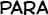</img>
      </img>
      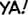</img>
			</img>
			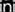</img>
			</img>
  	</td>
  </tr>
	<tr>
    <td>
      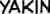</img>
			</img>
			</img>
			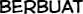</img>
      </img>
      </img>
			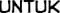</img>
			</img>
			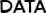</img>
  	</td>
  </tr>
</table>
Not all text blocks actually contains texts, here are all bad text blocks from slime page 4:

<table>
  <tr>
    <td>
      </img>
			</img>
			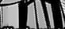</img>
			</img>
			</img>
  	</td>
  </tr>
</table>

**Todo: do the same for slime page 5**

##### Learned SIFT descriptor keypoints from text blocks (step 3)

Here are some keypoint descriptors learned from the text blocks that serve as vocabulary (visualized using open cv)

<table>
  <tr>
    <td>
      </img>
      </img>
      </img>
      </img>
      </img>
      </img>
      </img>
      </img>
      </img>
    </td>
  </tr>
</table>

**Todo: do the same for slime page 5**

##### Find good SIFT matches in input image and cluster using MeanShift (steps 4, 5, 6)

Red rectangles are sift mathces while green rectangles are match cluster centers. Grey rectangles are match centers discarded after thresholding on matched instances in each center.

<table>
	<tr>
		<th>Slime page 4 matches</th>
		<th>Slime page 5 matches</th>
	</tr>
	<tr>
		<td>
			</img>
		</td>
		<td>
			</img>
		</td>
	</tr>
</table>

##### Extracted speech bubble masks (steps 7, 8, 9)

Speech bubble masks extracted from slime page 4

<table>
  <tr><th>Good</th></tr>
	<tr>
		<td>
			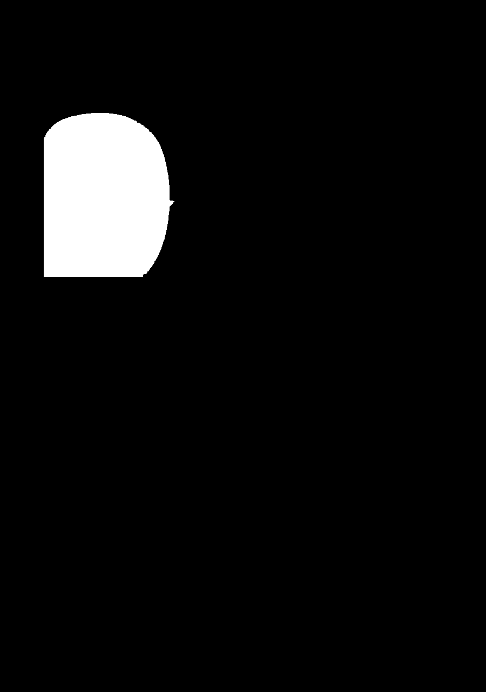</img>
		</td>
<td>
			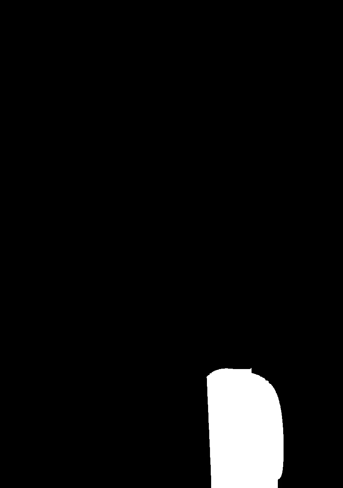</img>
		</td>
<td>
			</img>
		</td>
<td>
			</img>
		</td>
<td>
			</img>
		</td>
</tr>
<tr><th>Bad</th></tr>
	<tr>
		<td>
			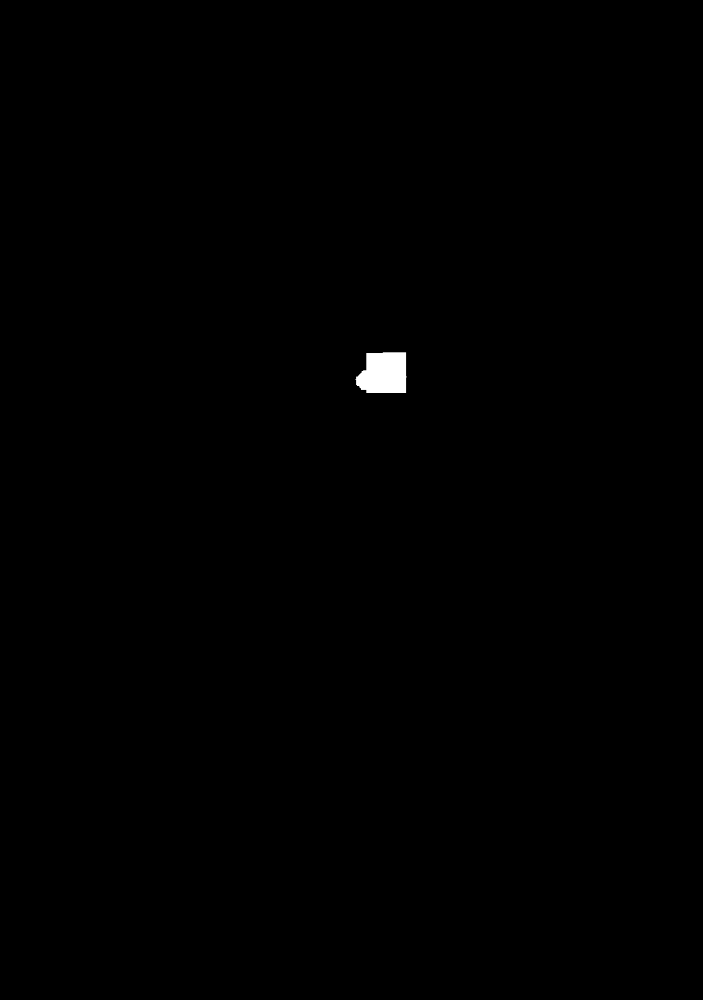</img>
		</td>
<td>
			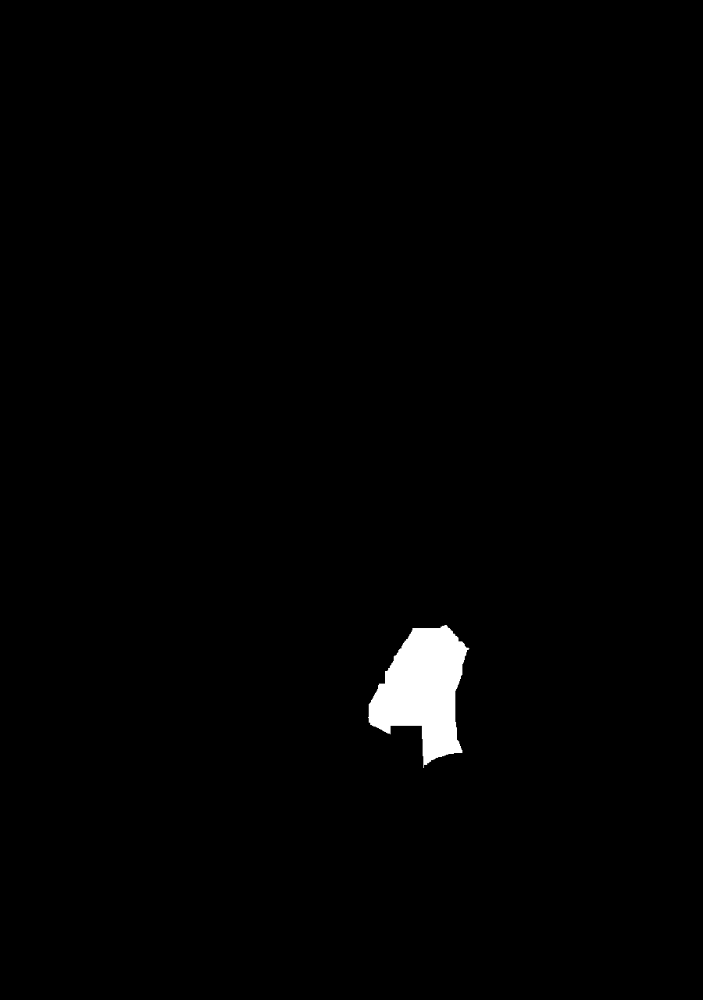</img>
		</td>
<td>
			</img>
		</td>
</table>

Speech bubble masks extracted from slime page 5

<table>
  <tr><th>Good</th></tr>
	<tr>
		<td>
			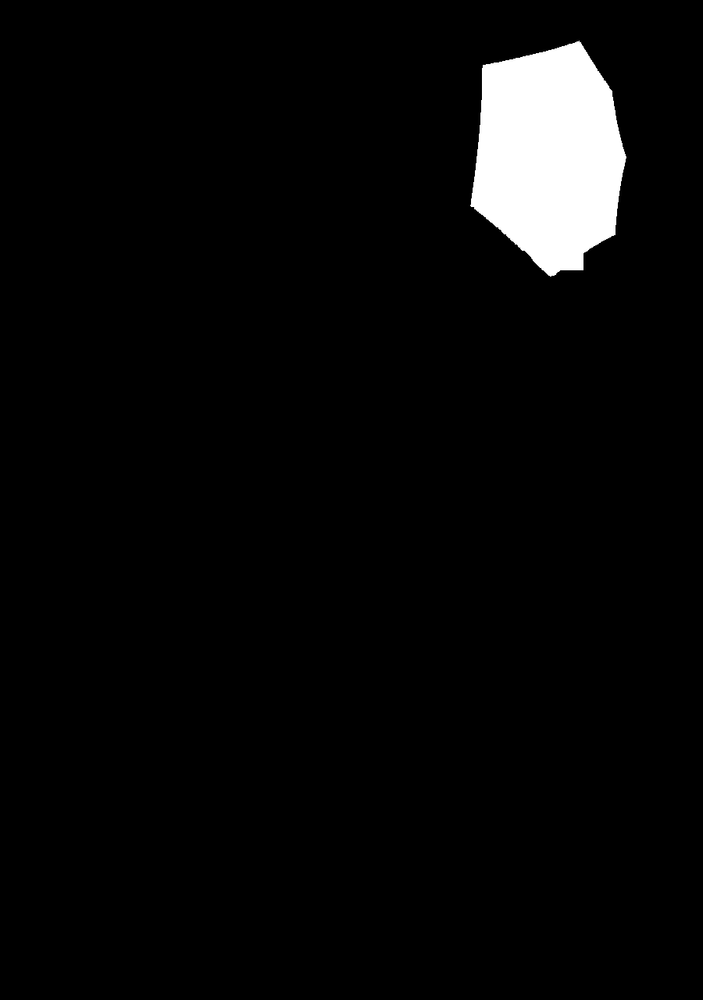</img>
		</td>
<td>
			</img>
		</td>
<td>
			</img>
		</td>
</tr>
</table>

##### Mask, crop, then detect text in speech bubbles (steps 10, 11, 12)

Results from slime page 4

<table>
  <tr>
    <td>
      </img>
    </td>
<td>
      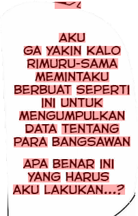</img>
    </td>
<td>
      </img>
    </td>
<td>
      </img>
    </td>
<td>
      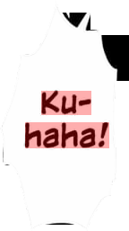</img>
    </td>
  </tr>
</table>

Results from slime page 5

<table>
  <tr>
    <td>
      </img>
      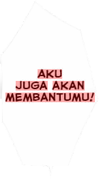</img>
      </img>
    </td>
  </tr>
</table>

##### Final Results 

Final results compared with baseline. Baseline is the text blocks detected by directly running Tesseract OCR on the input image.

Slime page 4 side by side comparison:

<table>
  <tr>
    <th>Baseline</th>
    <th>SIFT-OCR (Ours)</th>
  </tr>
  <tr>
    <td>
    	</img>
		</td>
		<td>
    	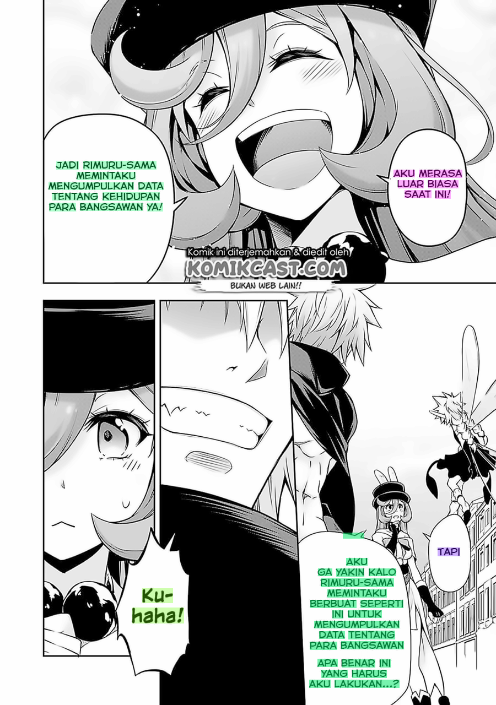</img>
		</td>
  </tr>
</table>

Slime page 5 side by side comparison:

<table>
  <tr>
    <th>Baseline</th>
    <th>SIFT-OCR (Ours)</th>
  </tr>
	<tr>
    <td>
    	</img>
		</td>
		<td>
    	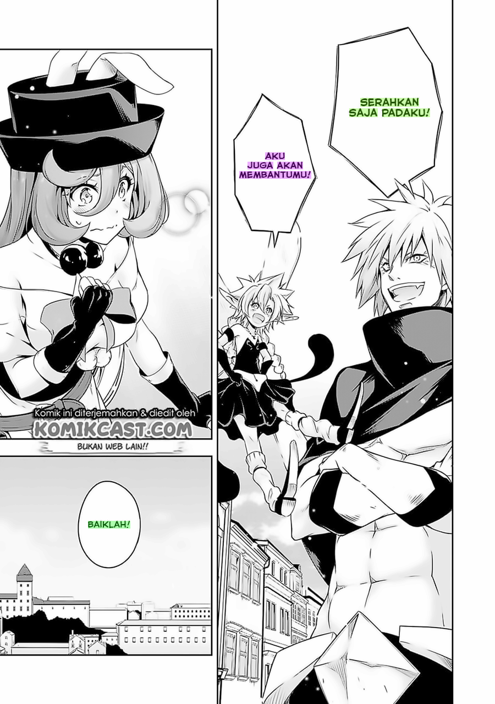</img>
		</td>
  </tr>
</table>

#### Parameters

#### Qualitative Results

[//]: # "qualitative_results.md"
[//]: # "
Show several visual examples of inputs/outputs of your system (success cases and failures) that help us better understand your approach.
"

### Conclusion

[//]: # "conclusion.md"
[//]: # "
Conclusion would likely make the same points as the abstract. Discuss any future ideas you have to make your approach better.
"

### References

[//]: # "references.md"
[//]: # "
List out all the references you have used for your work.
"

