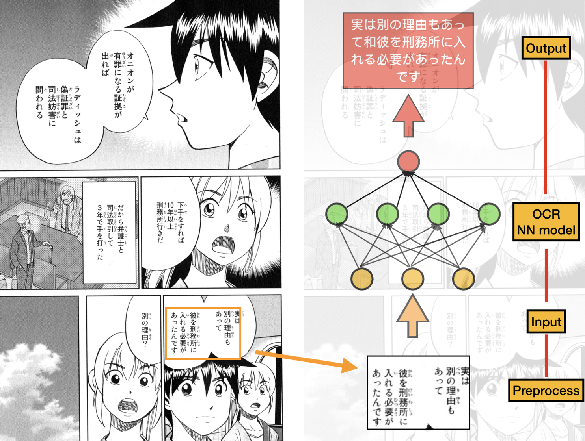

#### Data Set

To carry out this project, we need datasets of manga images to perform experiments on. However, despite our efforts, we couldn't locate any existing manga datasets in Japanese. What we do have at hand is a dataset of images already translated to English (for one of our member's NLP project). These images are collected using a web-crawler (written in dart) from this [website](https://mangasee123.com), and is purely used for research purposes. The crawler can be easily extended to collect raw manga resources from legitimate Japanese websites, and we intend to do that. 

However, if said resource is not attainable due to various reasons, we might change our objective to "translating from english to other languages." This is not too different from our current objective, since english texts in manga are in most cases **capitalized**, so we can easily employ hough transform for each letter or existing OCR methods to extract english texts, simplifying the problem statement.

It's unlikely that we'll train our own neural model for OCR, so we'll probably use pretrained models mentioned below.

#### List of Experiments

##### 1. Using Mask R-CNN to detect text boundaries

When documents are clearly laid out and have global structure (for example, a business letter), existing tools for OCR can perform quite well. In Manga, first, the document of interest occurs alongside some background objects . Second, the text within the document is highly unstructured and therefore it is beneficial to separately identify all the possible text blocks. Inspired by fully convolutional networks, we came up with the idea of modifying the model Mask R-CNN as an effective approach for text location, which is consisted of two steps. 

First, CNN is adopted to detect text blocks, from which character candidates are extracted. Then FPN is used to predict the corresponding segmentation masks. Last, segmentation mask is used to find suitable rectangular bounding boxes for the text instances. The model generates bounding boxes and segmentation masks for each instance of an object in the image.

For the token/character identification, we plan to identify the Japanese characters in the regions where we detect some text in the first step. Here we want to apply Optical Character Recognition to text images and extract individual Japanese characters in sequence from those images. We already found some code that implements this model ([Japanese OCR](https://github.com/phamdinhthang/japanese_OCR) and [Hiragana Identifier](https://github.com/RakuTheSenpai/Hiragana-Identifier)). At the same time, we expect our output of this step to be some form of sentences so that we can translate the sentences in Japanese to English context later. Since text in manga is usually aligned vertically from top to bottom, we want to first identify separate text columns by detecting blank areas between them, and this can be possibly implemented using a simple gradient energy map. After getting the columns, we may also want to segment the columns on a character-level basis (including punctuations). Then we plan to apply the recognition model we mentioned above to classify each individual character and concatenate them into complete sentences.

##### 2. Using Hough Transform and Canny Edge Detection to find speech bubbles and text.

Another experiment that we will carry out as an alternative to Mask R-CNN is to use hough transform and canny edge detection to locate text in manga and extract speech bubble bounding rectangles. We will compare how each of these methods performed (or, in reality, feasible), and select one for our implementation.

In addition to simply extracting bounding box for speech bubbles, we will experiment with a novel idea of identifying exact boundaries of speech bubbles (which can help with in-painting boundaries later). It works like so - 

- First, individual text characters are detected, potentially using hough transform.
- Using **kmeans** or **mean-shift**, we detect text cluster centers, which are likely to be the center to speech bubbles (see images above for an example). 
- Then, hypothesize a bubble boundary by drawing a body that encompasses all text characters in each cluster. Then, using the "snake" algorithm, facilitated by the gradient of the speech bubble's boundary, we can assume the exact shape of the speech bubble.

#### Expected Outcomes

Ideally, our end system should be able to perform the following

1. Extract & locate text in manga
2. Locate speech bubbles in manga
3. Using OCR, convert text in image to ASCII
4. Translate the text, then using original position, size, and spacing information, in-paint the translated text into their corresponding speech bubbles in the new manga.

We realize that there are still uncertainties in our setup and also expectation, but we will try our best.

