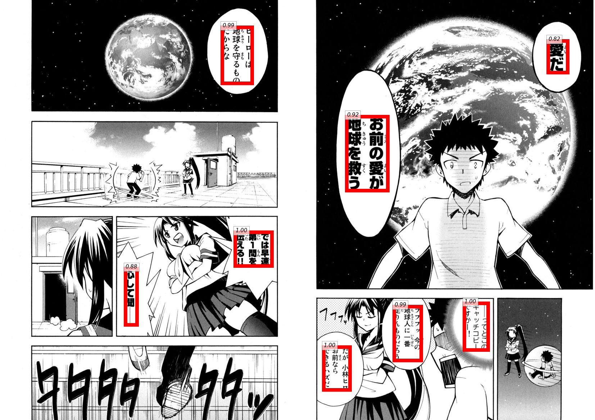

## Manga Text Extraction & Translation

[//]: # "abstract.md"
### Abstract

One or two sentences on the motivation behind the problem you are solving. One or two sentences describing the approach you took. One or two sentences on the main result you obtained.

[//]: # "introduction.md"
### Introduction

Manga have been around for over centuries and hundreds of mangas are printed everyday in Japan. However, manga has recently gained a rise of popularity and one of the reasons is due to the internet; manga are now digitized into web content and there are now many hosting websites where anyone can upload their web manga and users can read for free. However, most manga are written in Japanese or Korean, and to share manga to non-Japanese/Korean readers, a translation to English is needed. Yet, any translation work is time consuming labor since there is no automatic method to translate the writing in manga into any other language. The goal of this project is that by using image captioning, a user can input an image with manga in the original language to the system, utilizing text detection and identification model to get the manga inside it and the desired output is the manga with the text translated to English.

[//]: # "approach.md"
### Approach

#### Steps

1. Text Searching

   Using Mask R-CNN, we can detect where the text is located in the image and extract these characters for next step.

2. Token/Character Identification

   Applying OCR to text tokens and extract individual Japanese characters in sequence from those images

3. Inserting Text Back to Image

   Using machine translation API to translate the text content extracted to English

[//]: # "experiments-and-results.md"
### Experiments and Results

#### Data Set

For the text detection setp, we are going to utilize the image cropped from the websites. 

For the text recognition step, the data set used was taken from a Github repository, which contained 50 different characters and 20 different samples for each one. While sample size is small, a considerable level of certainty can be obtained utilizing a good learning model.

#### Experimental Steps

When documents are clearly laid out and have global structure (for example, a business letter), existing tools for OCR can perform quite well. In Manga, first, the document of interest occurs alongside some background objects . Second, the text within the document is highly unstructured and therefore it is beneficial to separately identify all the possible text blocks. Inspired by fully convolutional networks, we came up with the idea of modifying the model MaskRCNN as an effective approach for text location, which is consisted of two steps. 

First, CNN is adopted to detect text blocks, from which character candidates are extracted. Then FPN is used to predict the corresponding segmentation masks. Last, segmentation mask is used to find suitable rectangular bounding boxes for the text instances. The model generates bounding boxes and segmentation masks for each instance of an object in the image.

For the token/character identification, we plan to identify the Japanese characters in the regions where we detect some text in the first step. Here we want to apply Optical Character Recognition to text images and extract individual Japanese characters in sequence from those images. We already found some code that implements this model ([Link 1] and [Link 2]). At the same time, we expect our output of this step to be some form of sentences so that we can translate the sentences in Japanese to English context later. Since text in manga is usually aligned vertically from top to bottom, we want to first identify separate text columns by detecting blank areas between them, and this can be possibly implemented using a simple gradient energy map. After getting the columns, we may also want to segment the columns on a character-level basis (including punctuations). Then we plan to apply the recognition model we mentioned above to classify each individual character and concatenate them into complete sentences.

#### Expected Outcomes

We expect for each mango image input, after applying our model, we could gain the text content from it and translated into English. We are uncertain about the accuracy of the model that we are going to apply to train Japanese characters due to its structure. 

